# 图像颜值打分

这是 FlyAi平台上的一个趣味项目，项目地址：https://www.flyai.com/d/facialbeautyprediction

## 项目文件说明

* main.py：项目的主要运行文件，载入数据集，数据增强，训练模型都在这个文件中
* model.py：模型文件，定义模型都在这个文件中，在这个文件中提供的模型将初始化完成后返回给main.py中进行调用
* prediction.py：预测文件，训练完后再单独运行这个文件，载入训练好的模型进行预测
* shown.py：显示图片，实际训练中没有用到，在我写代码的过程中，做数据增强部分时使用这里面的函数来查看增强后的数据
* flyai_sdk.py：官方的sdk，没有这个文件在平台上提交会报错
* app.json：官方模版中自带文件，该应用的一些配置，我们不用管
* gender_class.py：我写的对本地数据进行性别分类的脚本，对数据手动打性别标签，暂时还没有加入到实验 中
* result：存放实验结果
* img：存放项目所用模型的架构图

其余文件，说明**略**...

## 部署项目

```shell
# 克隆本项目
git clone https://github.com/byack/facial-beauty-prediction.git

# 创建虚拟环境并安装相关包
cd facial-beauty-prediction
python -m venv venv
source ./venv/bin/activate
python -m pip install --upgrade pip
pip install -r requirements.txt
```

具体要运行哪个模型参考下方 **加入新模型代码的修改过程** 进行运行

## 加入新模型代码的修改过程

1. 在model.py中定义新的模型，并进行测试（在函数中把参数初始化好的模型返回回来）

2. 在main.py中导入新定义的模型，之后修改主函数中的如下内容：

   本地训练我的显存只有3G，我的 **batch_size** 要设置为8，你看设备来改；不同的模型你可以设置不同的 **lr** ；如果本地有数据了，**注释掉下载数据那一行代码** ；训练函数第一个参数就是你的**模型**，调用你模型的方法；保存模型时**设置保存模型的名字**，尽量和下方打印信息相吻合。

   ```python
   # 模型的一些参数
   batch_size = 8
   
   # 各个模型我所使用的 学习率
   lr = 5e-5  # myResnet4
   
   # 下载数据
   # main.download_data()
   
   # 开始训练，第一个参数就是你的模型，自行修改
   net = main.train(myResnet4(), train_loader, valid_loader, epochs, lr, device)
   
   # 设置保存模型的名称
   model_name = 'Resnet34.params'
   ```
   
3. 模型训练完成后，进入prediction.py文件进行预测，修改两行代码：如下

   ```python
   model_name = "Resnet34.params"  # 修改为我们刚刚保存模型的文件名
   net = myResnet4()  # 修改为我们刚刚训练的模型
   ```

4. 本地预测也没有问题，再修改几个参数就可以提交到平台上训练了，main.py修改内容如下：

   ```python
   batch_size = 64  # 服务器上训练可以改大一点，我用64
   
   # 下载数据
   main.download_data()  # 提交到平台上训练将这行代码取消注释
   ```

5. 将所需文件打包成压缩包提交，Linux下用终端的打包命令如下：

   ```shell
   zip -r main.zip app.json flyai_sdk.py gender_class.py main.py model.py prediction.py showm.py requirements.txt
   ```
   也可以在当前目录下执行 **zip-shell.sh** 脚本，直接自动打包

   之后就打开网站，上传压缩包，等待训练即可

# 项目模型及数据处理说明

## 预处理

* 这是基于人脸来做颜值打分，五官比例我们认为还是很影响评分的，所以我们做数据增强时保持原图比例不变，只做了 **随机翻转** 、**覆盖原图90%的区域进行裁剪为224\*224统一大小** 
* 构造数据集时进行随机打乱，训练集与验证集按 8:2 的比例进行划分

## 模型结构

> **各版本模型在最后实验结果部分可详细查看**

### Resnet及其改动

原版的Resnet18架构如下：

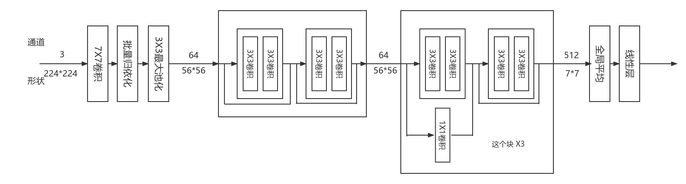

原版Resnet18经过调整学习率，我们训练拿到了44.43的评分。**最后的线性层从512之间下降到1，我们认为下降太快了，所以加入MLP对其进行改进** 。得到如下结构：

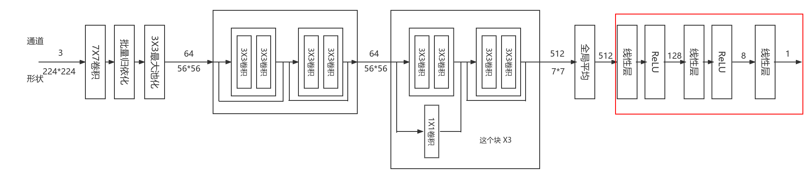

但这样的改动使模型评分倒退了，得到了33.42的评分。**这里我们有两个想法，一个是7\*7做平均池化数据太多，需要减少，另一个是我们的MLP层数不够**，所以在全局平均之前加入卷积减小每一个通道的大小，并加入更深的MLP在最后折半下降，得到如下模型：

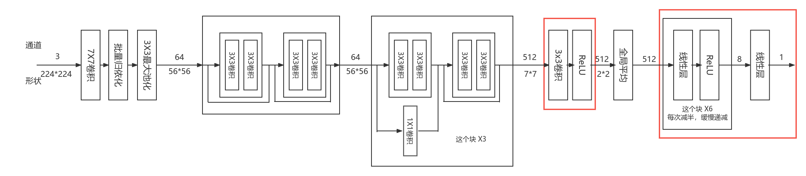

以上这一版模型拿到了48.01的评分，说明我们的改动是有效的，**我们进一步用卷积层来代替全局平均** ，得到如下模型：

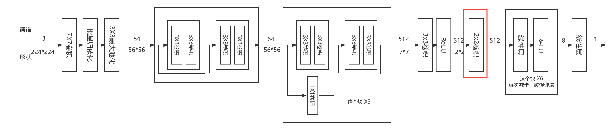

以上这一版模型评分为50.61，说明改动是有效的，但不知道是更深的MLP的效果还是卷积层带来的效果。**所以之后一版的模型中我们将MLP换为之前浅层的MLP**

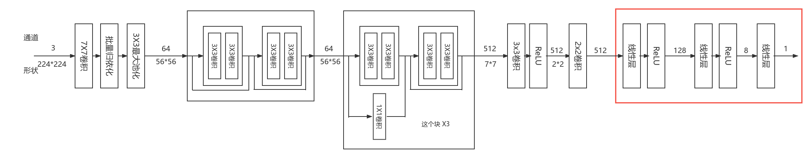

模型最后的MLP变浅之后，我们的分数稍有下降，得到49.99的评分。说明更深的MLP有一点效果，但不是主要影响因子。

在之后的实验中，我们偶然发现 **batch_size** 的大小对模型有很大的影响，以上结果所设置的 **batch_size** 大小都是 **64** 。选取以上最好的一版模型，将 **batch_size** 更改为 **4** 再进行训练，分数明显提高，评分为：**61.52**

> 补充：Resnet34我们也有实验，但训练之后在测试集上的打分集中于 0~1 之间，导致模型评分为 0，暂未对Resnet34更改解决这个问题

## Densenet及其改动

Desenet模仿Resnet18后的模型结构如下：

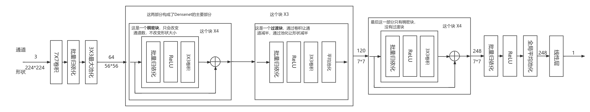

以上Densenet的训练我们遇到了和Resnet34一样的问题，训练时损失正常下降，但在测试集的评分集中在 1~2 区间上，导致模型评分为0分。**经过我们猜测，是卷积层数过多，模型过于复杂所导致这样的问题**，所以我们减少稠密块，进而减少了卷积层数量，并汲取之前训练的经验，在模型最后加入了MLP，得到如下模型：

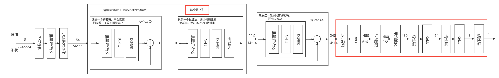

该模型评分51.75，说明我们的猜测和改动是正确的。

## VGG

项目中所用VGG的结构如下：

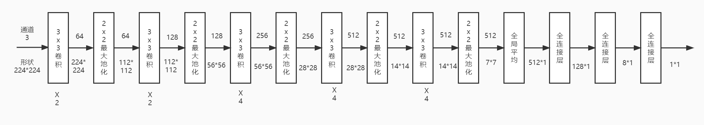

VGG部分的实验，我们终点比对了更改batch_size对模型的影响，具体看实验结果部分

## 实验结果

## Resnet18

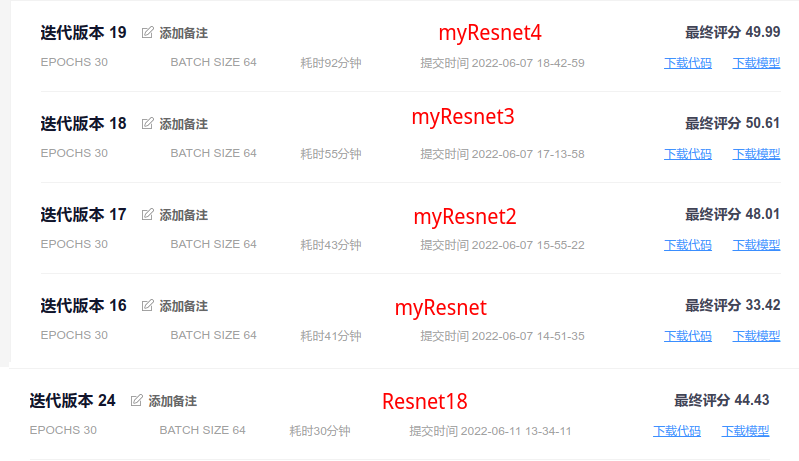

将myResnet3修改batch_size为4后再训练得到如下结果：

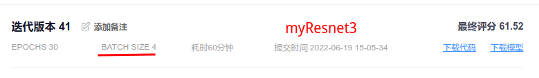

## Resnet34

Resnet34 训练 30 个Epoch 后的情况：

预测时给出的评分都很低，导致最后模型评分为 0 分

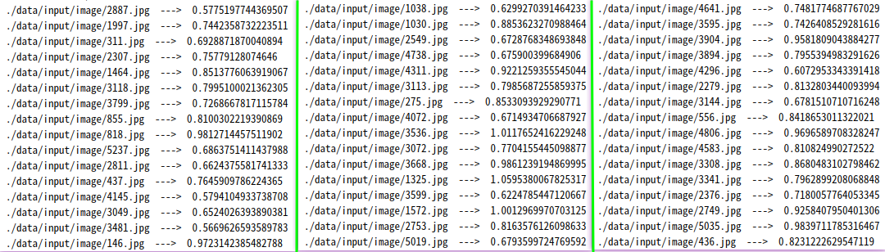

## Desenet

Desenet 模仿 Resnet18 的结构，跑出来的模型评分还是 0 分，预测集上的打分区间集中在 1~2 分之间。

修改过后的 myDesnet 效果好了不少

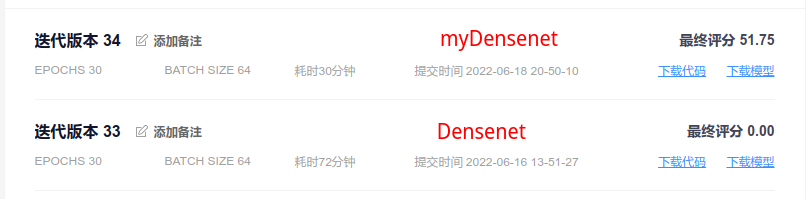

## VGG

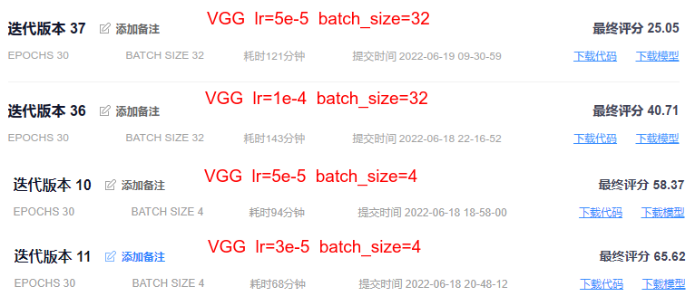

# 实验结论

* Resnet模型最后加入MLP是有一定效果的
* 用两层卷积替换掉Resnet中全局平均，能够提升模型的效果
* 测试集上评分偏低，可能是模型卷积层数过多所导致的问题
* batch_size的大小在该项目中影响很大，从VGG实验结果的37版本与10版本就可以发现，经过分析，我们认为是模型中使用了大量的批量归一化层所导致的，批量的减小，可以让归一化在更小的范围进行，进而让模型更加的精确

# 备注

* 初级 **炼丹师** ，各位大佬多多指教
