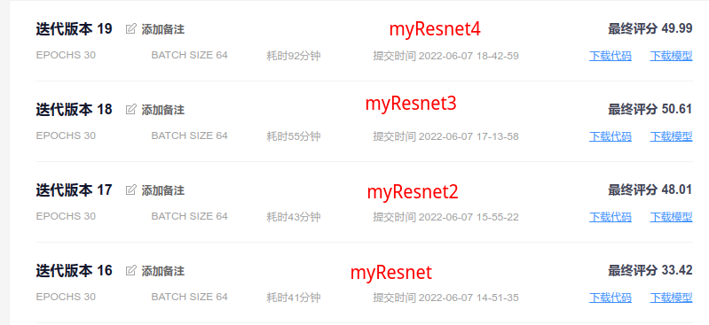

# 图像颜值打分

这是 FlyAi平台上的一个趣味项目，项目地址：https://www.flyai.com/d/facialbeautyprediction

## 项目文件说明

* main.py：项目的主要运行文件，载入数据集，数据增强，训练模型都在这个文件中
* model.py：模型文件，定义模型都在这个文件中，在这个文件中提供的模型将初始化完成后返回给main.py中进行调用
* prediction.py：预测文件，训练完后再单独运行这个文件，载入训练好的模型进行预测
* shown.py：显示图片，实际训练中没有用到，在我写代码的过程中，做数据增强部分时使用这里面的函数来查看增强后的数据
* flyai_sdk.py：官方的sdk，没有这个文件在平台上提交会报错
* app.json：官方模版中自带文件，该应用的一些配置，我们不用管
* gender_class.py：我写的对本地数据进行性别分类的脚本，对本地数据手动打性别标签，暂时没有用到

其余文件，说明**略**...

## 模型说明

暂时略，可看代码...

## 修改模型的过程

1. 在model.py中定义新的模型，并进行测试

2. 在main.py中导入新定义的模型，之后修改主函数中的如下内容：

   本地训练我的显存只有3G，我的 **batch_size** 要设置为8，你看设备来改；不同的模型你可以设置不同的 **lr** ；如果本地有数据了，**注释掉下载数据那一行代码** ；训练函数第一个参数就是你的**模型**，调用你模型的方法；保存模型时**设置保存模型的名字**，尽量和下方打印信息相吻合。

   ```python
   # 模型的一些参数
   batch_size = 8
   
   # 各个模型我所使用的 学习率
   lr = 5e-5  # myResnet4
   
   # 下载数据
   # main.download_data()
   
   # 开始训练，第一个参数就是你的模型，自行修改
   net = main.train(myResnet4(), train_loader, valid_loader, epochs, lr, device)
   
   # 将我们训练的模型保存下来
   torch.save(net.state_dict(), 'myResnet4.params')
   print("保存模型到myResnet4.params")
   ```

3. 模型训练完成后，进入prediction.py文件进行预测，修改两行代码：如下

   ```python
   net = myResnet4()  # 修改为我们刚刚训练的模型
   net.load_state_dict(torch.load("myResnet4.params"))  # 修改为我们刚刚保存模型的文件名
   ```

4. 本地预测也没有问题，再修改几个参数就可以提交到平台上训练了，main.py修改内容如下：

   ```python
   batch_size = 64  # 服务器上训练可以改大一点，我用64
   
   # 下载数据
   main.download_data()  # 提交到平台上训练将这行代码取消注释
   ```

5. 将所需文件打包成压缩包提交，Linux下用终端的打包命令如下：

   ```shell
   zip -r main.zip main.py prediction.py showm.py app.json flyai_sdk.py model.py requirements.txt
   ```

   之后就打开网站，上传压缩包，等待训练即可

## 提交结果


